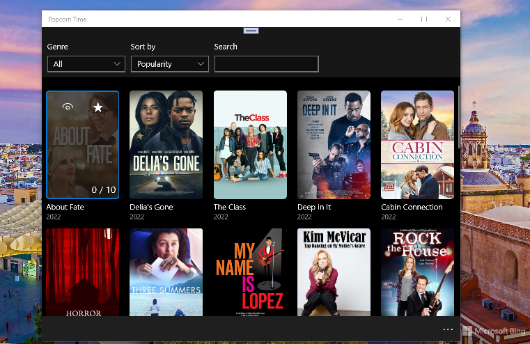

# Popcorn Time 0.1-alpha

Popcorn Time for Win10/Win11/Win10Mobile. Pear-to-Pear Tech Research only. Draft.

This is the only fork of [https://github.com/haroldma-zz/PopcornTime](https://github.com/haroldma-zz/PopcornTime) solution.

## Screenshots

## Status / Progress / My Research

- The Win10's os build switched from "old" 10240 to "actual" 15063...
- Movie detail demaged (Some serious bugs with FluentRest... that huge and buggy lib don't returns any data on http reqests)

## Solution Dependencies

Popcorn Time depends on `Universal.Torrent` and `Universal.Nat` for utilizing the torrent procol and port mapping.  
Each of them are included as submodules. Also Universal.FluentRest lib used to debug some http requests and responces... 

## How to clone&build

When cloning make sure to include the `--recursive` argument like so:
    
git clone --recursive https://github.com/mediaexplorer74/PopcornTime

## .

AS IS. No support. For research purposes only.

## ..
[m][e] 2022
