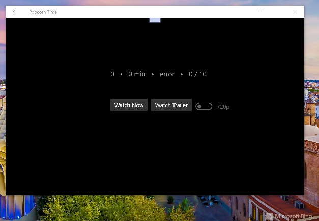

# Popcorn Time 0.1-alpha

Popcorn Time for Win10/Win11/Win10Mobile. Pear-to-Pear Tech Research only. Draft.

This is my "ugly" fork of [https://github.com/haroldma-zz/PopcornTime](https://github.com/haroldma-zz/PopcornTime) solution.

Application obsolete. All its functions damaged. 

Experienced C# developers help wanted. 

## Screenshots

## Status / Progress / My Research

- The Win10's os build switched from "old" 10240 to "actual" 15063...
- Any movie detail info damaged (Some serious bugs with FluentRest... 
that huge and buggy lib don't returns any data on http requests...)
- I explored / noticed that https://yts.mx/api/v2/movie_details.json?movie_id=44981 request is well-done:

{"status":"ok","status_message":"Query was successful","data":{"movie":{"id":44981,"url":"https:\/\/yts.mx\/movies\/about-fate-2022","imdb_code":"tt14456350","title":"About Fate","title_english":"About Fate","title_long":"About Fate (2022)","slug":"about-fate-2022","year":2022,"rating":0,"runtime":100,"genres":["Comedy","Romance"],"download_count":5353,"like_count":5,"description_intro":"The romantic comedy is a tale of two people who believe in love, but seem to never be able to find its true meaning. In a wild twist of events, fate puts each in the other's path on a stormy New Year's Eve and comedy and chaos ensue.","description_full":"The romantic comedy is a tale of two people who believe in love, but seem to never be able to find its true meaning. In a wild twist of events, fate puts each in the other's path on a stormy New Year's Eve and comedy and chaos ensue.","yt_trailer_code":"BVtN9rwoGpw","language":"en","mpa_rating":"R","background_image":"https:\/\/yts.mx\/assets\/images\/movies\/about_fate_2022\/background.jpg","background_image_original":"https:\/\/yts.mx\/assets\/images\/movies\/about_fate_2022\/background.jpg","small_cover_image":"https:\/\/yts.mx\/assets\/images\/movies\/about_fate_2022\/small-cover.jpg","medium_cover_image":"https:\/\/yts.mx\/assets\/images\/movies\/about_fate_2022\/medium-cover.jpg","large_cover_image":"https:\/\/yts.mx\/assets\/images\/movies\/about_fate_2022\/large-cover.jpg","torrents":[{"url":"https:\/\/yts.mx\/torrent\/download\/9BE831DA43C5601E088F48D7A08DC3BA9C1EB17C","hash":"9BE831DA43C5601E088F48D7A08DC3BA9C1EB17C","quality":"720p","type":"web","seeds":0,"peers":0,"size":"913.84 MB","size_bytes":958230692,"date_uploaded":"2022-09-09 09:06:06","date_uploaded_unix":1662707166},{"url":"https:\/\/yts.mx\/torrent\/download\/06609DF653A1D0695CADBAA14057CBD5481E0A4A","hash":"06609DF653A1D0695CADBAA14057CBD5481E0A4A","quality":"1080p","type":"web","seeds":148,"peers":148,"size":"1.83 GB","size_bytes":1964947538,"date_uploaded":"2022-09-09 10:11:08","date_uploaded_unix":1662711068}],"date_uploaded":"2022-09-09 09:06:06","date_uploaded_unix":1662707166}},"@meta":{"server_time":1662734130,"server_timezone":"CET","api_version":2,"execution_time":"0 ms"}}

Maybe, this info helps to anyone for code fixing... idk

## Solution Dependencies

Popcorn Time depends on `Universal.Torrent` and `Universal.Nat` for utilizing the torrent proещcol and port mapping.  

Each of them are included as submodules. 

Also Universal.FluentRest lib used to debug some http requests and responces... 

## How to clone&build

When cloning make sure to include the `--recursive` argument like so:
    
git clone --recursive https://github.com/mediaexplorer74/PopcornTime

## .

AS IS. No support. For research purposes only.

## ..
[m][e] 2022
